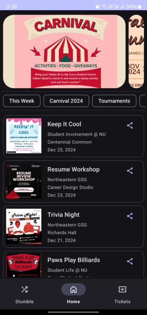

# Stumble

Stumble is an Android app designed for event discovery and ticket booking, tailored specifically for Northeastern University students. This project was developed as part of my coursework in Fall 2024, integrating concepts from two courses:

- **CS 5430 (Computer/Human Interaction)**: Focused on user experience design, I applied techniques such as paper prototyping and tools like Figma for UI design. I incorporated Material Design principles for enhanced usability.
- **CS 5520 (Mobile App Development)**: This course deepened my understanding of modern Android development, where I worked extensively with Firebase and explored the evolving Android technology landscape.

Learn about how I transformed the idea behind Stumble into a fully functional app here 👉 [anikeshk.com/project/stumble](https://anikeshk.com/project/stumble/)